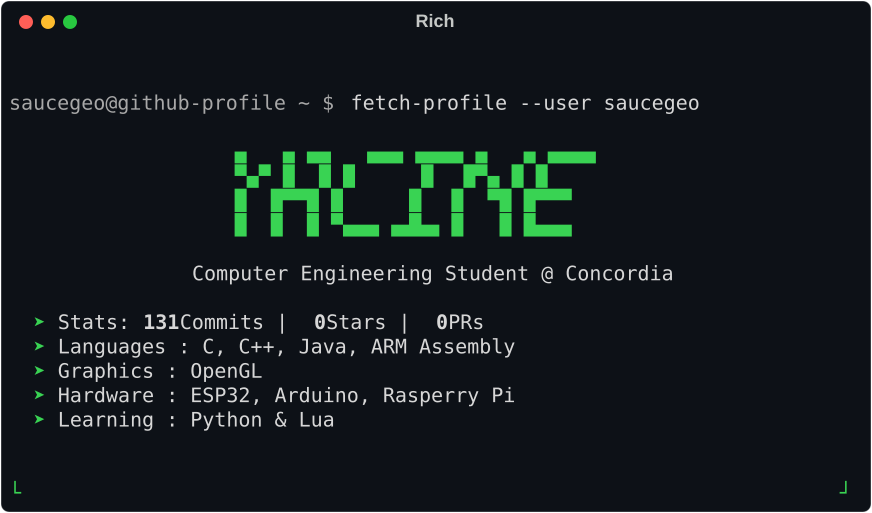

  <picture>
    <source media="(prefers-color-scheme: light)" srcset="./assets/terminal-light.svg">
    <source media="(prefers-color-scheme: dark)" srcset="./assets/terminal-dark.svg">
    
  </picture>

